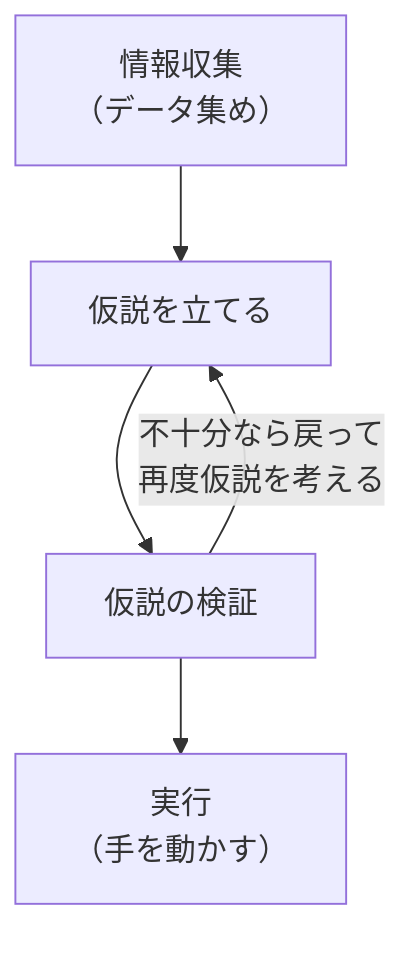
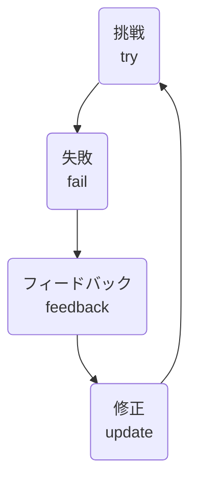

# **はじめに**
『世界一流エンジニアの思考法』の評価も高くとても勉強になる内容でした。アウトプットも兼ねて要約します。

:::message

個人的に重要だなと感じたところをかいつまんで要約としています。
お手元で購入していただくことをおすすめします。

https://www.amazon.co.jp/%E4%B8%96%E7%95%8C%E4%B8%80%E6%B5%81%E3%82%A8%E3%83%B3%E3%82%B8%E3%83%8B%E3%82%A2%E3%81%AE%E6%80%9D%E8%80%83%E6%B3%95-%E7%89%9B%E5%B0%BE-%E5%89%9B/dp/4163917683

(アフィリエイトリンクではありません)

:::

# **第1章: 世界一流のエンジニアは何が違うのだろう？**

## **手を動かす前に仮説を検証する**
試行錯誤をするのではなく、事実をもとに仮説を立てて検証する。例えば、バグ修正の際にやみくもに手を動かさず、まずログなどの事実に基づいて仮説を立て、その仮説を検証することで、効率的に問題を解決している。

## **理解に時間をかける**
早く成果を出そうと焦ると、最終的には生産性が低下につながってしまう。例えば、コードやその背後にある原理を理解せずにコピペで対処すると、根本を把握していないため、トラブルに弱く、結果的に生産性が悪くなる。

理解とは
  - その構造をつかんで、人に説明できること
  - いつでもどこでも即座に取り出して使えること
  - 知見を踏まえて応用がきくこと

「理解は時間がかかるもの」として急がず、時間をかけて徹底的に理解する習慣を身につけることが重要。理解していると試行錯誤の回数が減って、問題を一直線に解決できるようになる。

## **ファクトを積み上げる**
問題解決にはファクトベースで取り組むことが重要。AとBの方法があり、Aがうまくいかなかった場合、早急にBを選択するのは悪手。うまくいかなかった原因を事実に基づいて認識し、検証することで、思い込みの穴に落ちることを避けられる。

## **デザインドキュメントを書く**
デザインドキュメントとは、設計のアイデアと大まかな仕様を書いた小さなドキュメント。

デザインドキュメントを書くメリット
- 頭の中を整理することができる
- 抜け落ちていた視点に気づくことができる
- 引き継ぎなどが楽になる

デザインドキュメントは基本的にはエンジニアのためのものであり、時間をかけすぎないこと。

## **メンタルモデルの活用**
メンタルモデルとは思考のフレームワークのようなもの。

例えば、「MVP（Minimum Viable Product）は、どんなに最良のものを作ろうとしても、ユーザのフィードバックを受けて改良する必要があるため、最小限の機能でリリースすべき。」というメンタルモデルが定着していると、素早く情報を処理して意思決定がスムーズになる。

筆者は「システム思考」というものをアレンジして使っている。ソフトウェアのアーキテクチャなどの全体を先に把握してから、部分の情報を当てはめていく。これを脳内でイメージとして構築しておく。

## **エキスパートに頼る**
1つのことで2時間以上ブロックされるなら、質問や相談してレスポンスを待ってる間に別の業務をする方が生産性が高い。

# **第2章: アメリカで見つけたマインドセット**

## **Be Lazy**
より少ない時間で最大の価値を生み出すためのマインドセット。

## **2-8の法則**
「2-8の法則」（パレートの法則）は、全体の20%の仕事が80%の価値を生み出すという原則。このため、この20%に焦点を当てれば、効率的に成果を上げることができる。ある案件で20%のタスクを終えて80%の成果が出たら、残りの20%はやらずに次のタスクに移る。このように、実施すべき物量が少なくて価値が高いものを作る工夫が、生産性の高さにつながる。

## **やることを減らすことが価値**
やることを減らすこと自体に価値があるという考え方。日本人はすべてのタスクをやらないと悪いように考え、細部までピカピカに磨きがちだが、アメリカでは最小限の労力で最大の価値を追求する。やることを減らすことで時間的・体力的な余裕ができ、付加価値の高いことに集中できる。

やることを減らすための工夫
- 1つだけをピックアップする
- 時間を固定する
- 準備・持ち帰りをやめて、その場で解決する

## **リスクや失敗を受け入れる**
失敗を強く非難される環境では、失敗を恐れてリスクを取ることができなくなる。失敗を恐れてチャレンジを起こさないことは長期的にみて、会社のリスクを高める。

失敗を受け入れる具体的な実践方法
- フィードバックを歓迎するムードを作る
- Fail Fast

### Fail Fast
Fail Fastとは、まずやってみてして、早くフィードバックをもらい、早く間違いを修正していく。つまり、はやめに失敗して軌道修正していこうみたいなこと。

`try → fail → feedback → update`のサイクルを速く回すことが重要

## **不確実性を受け入れる**
人には「不確実性の回避」という文化的性質がある。このため綿密に計画を立てて未来を予測しておくという行動がとられるが、計画通りにいかないことが多い。

予想外のことが発生したときに、無理して計画通りに進めるのではなく、スピーディーに軌道修正かける方が大切。例えば納期について計画通りにいかない場合、「品質を落とす」「金を払う」「スコープを減らす」の3つの選択肢がある。納期を固定したままスコープを減らすのが現実的。

無理して計画通りに進めて、チームの適正な生産量を超えた場合、だったら次もできるよねみたいな悪循環が発生するので悪手。

計画の変更は悪ではない。現実を見てフィードバックを得て、納期や仕様が変わっていくことは善。

## **バリューストリームマッピングで「見える化」**
マインドというより具体的な手法。現在の開発プロセスを見える化し、改善ポイントを見つけてリードタイムを短縮する手法。開発に携わる全員を集めて、図式化して改善ポイントを話あう。

---

# **第3章: 脳に余裕を生む情報整理・記憶術**

## **コードリーディングのコツ**
コードリーディングのコツは極力コードを読まないこと。細かい実装はなるべく読まないようにして、関係性をグラフをメモしながら、全体的な構造を理解するようにする。読むコードを減らすことで脳の負荷を軽減し、大事な部分に脳のリソースを使うことができる。

## **マルチタスクはやらない**
マルチタスクは生産性を著しく低下させるため避けるべきである。ワシントン大学の研究では「生産性が40%低下」「ミスの発生が50%増加」という研究結果がある。

ポイント
- 時間を割り当て1つのことに集中する
- 1タスクを中断する場合は、次に再開するときにすぐにその状態に戻れるようにしておく
- タスクの残骸は消しておく(気が散るので)

## **記憶力を鍛える**
細かいことを覚えていない原因は、理解の浅さにあるかもしれない。自分がやったことをクリアに説明できるように時間をかけて言語化する。ブログなどでアウトプットするのも良い。

普段から人に説明する前提で理解を進めていくのが良い。

## **頭の中でのみ整理**
頭の中でイメージを膨らませて理解を深めることが効果的。

ポイント
- 人の話を聞くときは頭の中でイメージを膨らませながらきく
- あとで人に説明するという前提で話を聞く(わからないことが明確になったり、集中力も上がる)
- 理解したことを文章などにアウトプットする

# **おわりに**
今回は自分にとって、特に重要だと感じた第1章〜第3章の要点をまとめました。

この後、「第4章コミュニケーションの極意」「第5章 生産性を高めるチームビルディング」「第6章 仕事と人生の質を高める生活習慣術 」「第7章 ＡＩ時代をどう生き残るか？」と続いていきますが、内容が気になる方はぜひ購入してみてください。